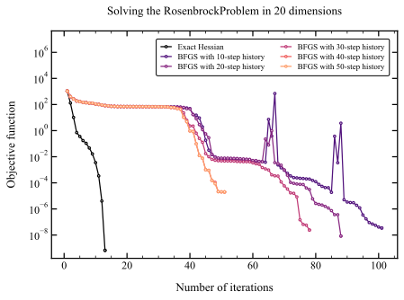
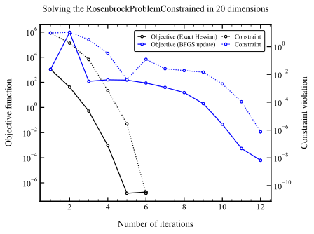
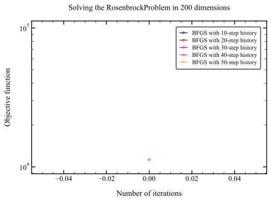

# Influence of Hessian update on convergence

## IPOPT results

- **Description:**
  - Solution of the unconstrained and constrained Rosenbrock problems using IPOPT
  - Hessian approximations investigated:
    - Approximation of the full Hessian matrix using finite differences
    - BFGS Hessian update using different number of previous steps
- **Results:**
  - Unconstrained:
    - The number of iterations when using the full Hessian is insensitive to the number of variables. The convergence rate is also be very fast even if the number of dimensions is increased to 100 or 1000.
    - By contrast, the number of iterations when using the BFGS update is quite sensitive to the number of problem variables.
    - When using the BFGS the convergence rate increases when the number of previous steps is increased. The Hessian approximation is more accurate when it is not reseted
    - IPOPT requires many more iterations in the unconstrained case when using the BFGS update, regardless of the number of previous steps in memory. This is probably because IPOPT is an interior point algorith, that is more suitable for constrained problems.
  - Constrainted:
    - The convergence of IPOPT is very good both with the full Hessian and the BFGS Hessian update.
    - The convergence is slightly better when using the full Hessian, but the additional cost of computing the second derivatives using finite differences will most likely outweight the reduced number of iterations, rendering the full Hessian finite difference approximation unpractical for real problems.
    - The main limitation is the number of function evaluations required by the 2nd order finite differences scaled quadratically with the number of design variables.
    - The number of function evaluations for the full Hessian would only scale linearly when using automatic differentiation, making it a very attractive alternative when using IPOPT.
  - Providing Hessian information seems to be more important as the number of optimization variables increases. This makes sense because the BFGS update struggles to capture the curvature of the problem by using gradient differences when the design space has high dimensionality. Is this a manifestation of the curse of dimensionality for the BFGS formula?

  
  

  
  

<figure>
  
</figure>

## SNOPT results

- **Description:**
  - Solution of the unconstrained and constrained Rosenbrock problems using SNOPT
  - Hessian approximations investigated:
    - BFGS Hessian update using different number of previous steps
    - The full Hessian matrix was not investigated because the SNOPT algorithm is a strict quasi-Newton method that does not have the option to use user-provided Hessians.

- **Results:**
  - Unconstrained:
    - The number of iterations when increases when the number of problem variables increases.
    - The convergence rate increases when the number of previous steps is increased because the Hessian approximation is more accurate.
    - This suggestes that the BFGS update struggles to capture the curvature of the problem by using gradient differences when the design space has high dimensionality, or when it is reseted frequently.
  - Constrainted:
    - The convergence of SNOPT is very good regardless of the number of previous BFGS steps because the problem converges in a small number of iterations.
    - This might be because the optimal solution lies in the active set and SNOPT is very efficient at identifying this point.
 

  
  

  
  

