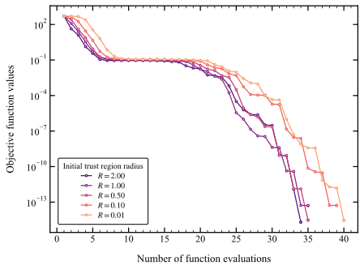

# Analysis of trust-constr Initial Trust Region Radius
- Initial steps influenced by this parameter
- Reducing the initial trust region radius leads to less aggressive initial steps
- Total number of iterations can change slightly, but reducing initial step does not lead to significantly more iterations
- Reducing the inital trust region redius can be effective to reduce initial overshoots
<figure>
    
</figure>