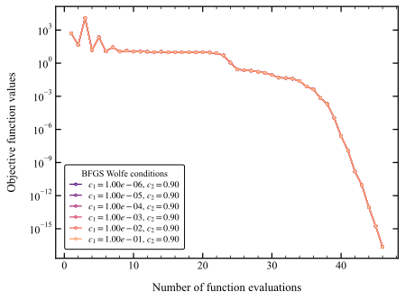
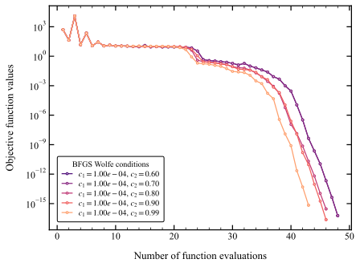

# Analysis of BFGS Wolfe Condition Parameters
- The c1 parameter has no significant impact
- The c2 parameter has some influence near the optimal solution but no impact during initial line searches
- Controlling the Armijo (c1) and Curvature (c2) parameters of does not have a significant impact on the convergence history of the Rosenbrock problem
- Controlling the strategy to set alpha has potentially a bigger influence
- I have not managed to get a good monotonous behavior my making some simple hard-coded changes to the line search of the BFGS
- I tried to limit the maximum step size of the line search, but I did not get very good results for the Rosenbrock problem (bad convergence and still experienced overshoots)
- I know it is possible to get a good monototnous line search because the L-BFGS-B achieves it

<figure>
    
</figure>

<figure>
    
</figure>
